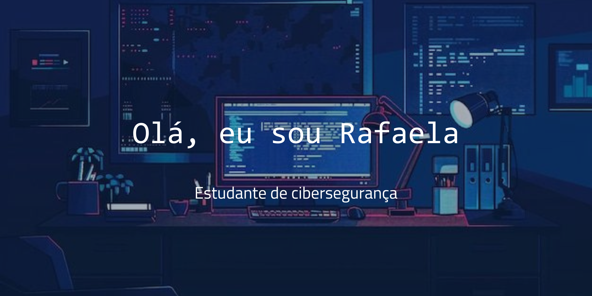

## 📬 Entre em contato

---
## 💡 Sobre Mim

Sou estudante de Defesa Cibernética, entusiasta da área e movida pela curiosidade em entender, proteger e fortalecer sistemas digitais. Tenho como objetivo aplicar meus conhecimentos técnicos em cenários reais, contribuindo para a construção de ambientes mais seguros, resilientes e eficientes. Busco oportunidades que impulsionem meu crescimento profissional e permitam colaborar em projetos de impacto.

---

## 🛠 Habilidades

  
   
  
  
  
  
  

---
## 📚 Em Constante Aprendizado
Atualmente focada em:

- Fundamentos de segurança ofensiva e defensiva  
- Análise de vulnerabilidades e técnicas de *hardening*  
- Automatização de tarefas com Python aplicadas à cibersegurança  
- Introdução ao JavaScript  

--- 
